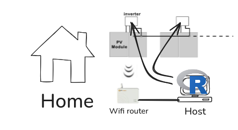
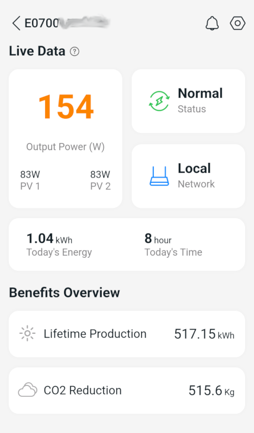
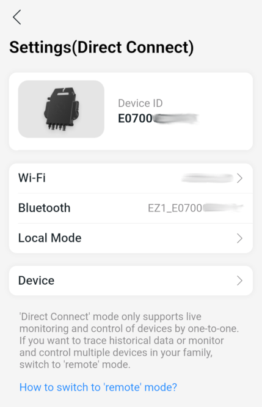
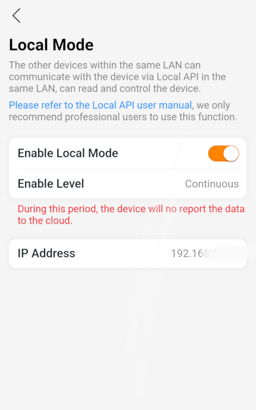

```{r, include = FALSE}
knitr::opts_chunk$set(
  collapse = TRUE,
  comment = "#>"
)
```

# APsystems device coverage

The following APSystems devices are covered :

| Inverter Model | Firmware version | Configuration         |
|----------------|------------------|-----------------------|
| EZ1            | ≥ 1.7.0          | Continuous local mode |

# Continuous local mode for your micro-inverter

## Design

Permanent local mode is a setup configuration of your micro-inverter that allow REST API calls from the local network to the inverter.

Here is the high level network setup :

## Inverter setup

Here is a summary of the expected configuration of each and every inverter to reach. Please refer to official manufacturer user manual for the detailed setup.

| Direct-connect device page                 | Direct-connect device settings          | Setting local mode for Continuous local mode |
|------------------------|-----------------------|-------------------------|
|  |  |           |
